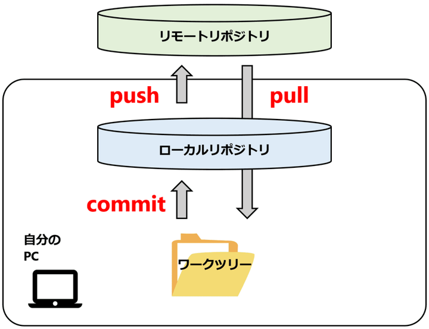

今日の学習時間：5時間程度

今日の学習内容、並びに理解したこと：
station2でyarn installをたたいたらテストが通ってくれた
テストコードでyarnをつかってるから通らなかったっぽい

```java
git branch // 今どんなブランチが存在していて、どこをいじっているか？
git branch {ブランチ名} // 新しいブランチを作る
git switch {ブランチ名}　// 指定したブランチに移動
コピーライト表示というものがあるらしい。©
どうやら著作権表示らしい。
git push {リモート名} {ブランチ名}　// 自分の変更をGitHub本体に登録する
git remote -v //リモート名一覧が見れる
git pull {リモート名} {ブランチ名} // GitHubの変更を知れる
git fetch {リモート名} // Githubの変更をコードに反映する
git merge {マージ元のブランチ名} // branchをくっつける作業
```

プルリクエスト　リポジトリの変更をレビューしてもらってからマージする機能
困ったこと：commitしてないとのエラー文が出てきた。(<https://qiita.com/kota9/items/4226e9d4e538c881d410>　　これで解決。)
　　　　　　コンフリクトが出た(<https://qiita.com/zakino123/items/0147eb091dbfac71929a>　これで解決。)
次やること：station6からがつがつ進める

