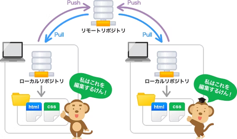

今日の学習時間Part2：30分くらい

今日の学習内容、並びに理解したこと：
macでもできるようにgithubからhtmlを引っ張ってきた。
また、memoをgithub上で管理できるようにリポジトリを作ってみた(数が多くなったらディレクトリ構造とかは別で考える。)

困ったこと：macにcloneしたら初期状態だった。どうやらwindowsでadd→commitとやってしまったみたい。add→push→commitを忘れないようにしよう。（以下イメージ図）

次やること：station3からがつがつ進める